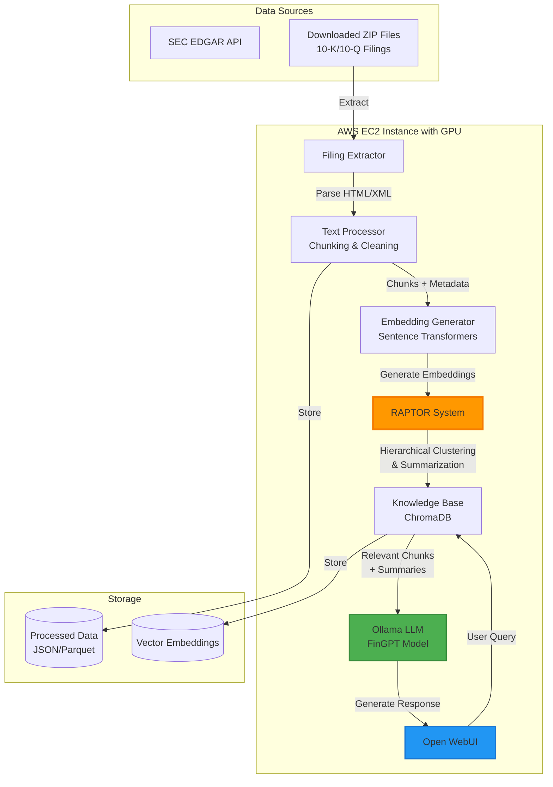

# SEC EDGAR Risk Factor Analysis - RAPTOR RAG System

AI-powered system for analyzing SEC 10-K and 10-Q filings using RAPTOR RAG (Recursive Adaptive Processing and Topical Organizational Retrieval). The system creates an enhanced knowledge base from financial filings that users can query interactively to identify year-over-year changes, risk patterns, and potential anomalies.

## Project Overview

**Core Technology:** RAPTOR RAG with hierarchical clustering and multi-level summarization

**Data Sources:**
- **Primary:** Downloaded 10-K and 10-Q filings (1993-2024)
- **Coverage:** 31 years of SEC EDGAR filings
- **Target Sections:** Item 1A (Risk Factors), MD&A, and other disclosure sections

**Infrastructure:**
- **Deployment:** AWS EC2 instance with GPU
- **Model Hosting:** Ollama for local LLM deployment
- **User Interface:** Open WebUI for interactive queries
- **Storage:** Cloud-based vector embeddings and knowledge base

## Key Features

- **Hierarchical Document Processing:** Multi-level clustering (UMAP + GMM) organizes content into coherent themes
- **Recursive Summarization:** 3-level hierarchical summaries capture both granular details and high-level concepts
- **Enhanced Retrieval:** Cluster-aware context retrieval provides richer information for LLM queries
- **Interactive Querying:** Users can ask arbitrary questions about filings via Open WebUI
- **YoY Analysis:** Semantic understanding of year-over-year changes without manual feature engineering
- **Boilerplate Detection:** Clustering naturally groups repetitive language patterns

## Architecture



## RAPTOR vs Traditional RAG

| Feature | Traditional RAG | RAPTOR RAG |
|---------|----------------|------------|
| Text Processing | Simple chunking | Recursive, hierarchical |
| Clustering | None or basic | Multi-level (global + local) |
| Summarization | None or single-level | Recursive, 3-level |
| Context Selection | Similarity-based only | Cluster-aware + similarity |
| Document Understanding | Flat representation | Hierarchical representation |
| Knowledge Integration | Direct chunks only | Chunks + multi-level summaries |

**Why RAPTOR for Financial Filings?**
- Financial documents have hierarchical structure (sections, subsections, themes)
- YoY analysis requires understanding both granular changes and high-level shifts
- Boilerplate detection benefits from cluster analysis (repetitive language clusters together)
- Complex queries need multi-level context (e.g., "How did cyber risk disclosures evolve?")

## Setup

### 1. Install Dependencies
```bash
pip install -r requirements.txt
```

**Key Libraries:**
- `langchain`, `langchain_community` - LLM orchestration
- `sentence-transformers` - Local embeddings
- `umap-learn` - Dimensionality reduction
- `scikit-learn` - Clustering algorithms (GMM)
- `pandas`, `numpy` - Data manipulation
- `chromadb` - Vector storage
- `ollama` - Local LLM serving

### 2. Data Preparation

**Current Data Holdings (1993-2024):**
- 31 years of historical SEC EDGAR filings
- Located in `data/external/` (downloaded archives)
- Includes both 10-K annual reports and 10-Q quarterly filings

```
data/external/
├── 1993-2000/          # Historical data
├── 2001-2010/          # (if applicable)
├── 2011-2024/          # Recent data
└── ...
```

### 3. Run Processing Pipeline

```bash
# Extract and process filings
python src/data/filing_extractor.py

# Generate embeddings and build RAPTOR knowledge base
python src/pipeline/knowledge_base_builder.py
```

### 4. Deploy on EC2 (Production)

```bash
# Set up Ollama with FinGPT model
ollama pull <fingpt-model>

# Deploy Open WebUI
docker run -d -p 3000:8080 --add-host=host.docker.internal:host-gateway \
  -v open-webui:/app/backend/data --name open-webui --restart always \
  ghcr.io/open-webui/open-webui:main
```

## Project Structure

```
edgar_anomaly_detection/
├── README.md
├── CLAUDE.md                          # Development guidelines
├── requirements.txt
├── .gitignore
│
├── config/
│   └── companies.json                 # Company configuration
│
├── notebooks/
│   ├── 01_project_plan.ipynb          # ✅ Comprehensive project plan with diagrams
│   ├── 02_data_collection.ipynb       # ✅ Data collection documentation
│   └── 03_raptor_testing.ipynb        # (TBD) RAPTOR validation
│
├── src/
│   ├── data/
│   │   ├── filing_extractor.py        # (TBD) Unzip and parse filings
│   │   └── text_processor.py          # (TBD) Chunking and cleaning
│   │
│   ├── models/
│   │   ├── raptor.py                  # (TBD) Main RAPTOR class
│   │   ├── embedding_generator.py     # (TBD) Sentence Transformer embeddings
│   │   └── clustering.py              # (TBD) UMAP + GMM clustering
│   │
│   ├── pipeline/
│   │   └── knowledge_base_builder.py  # (TBD) End-to-end RAPTOR pipeline
│   │
│   └── analysis/
│       └── query_handler.py           # (TBD) Process Open WebUI queries
│
├── dashboard/
│   └── README.md                      # Open WebUI setup instructions
│
└── data/                              # Excluded from Git
    ├── raw/                           # ZIP files of downloaded filings
    ├── processed/                     # Extracted, chunked text
    ├── embeddings/                    # Generated vector embeddings
    └── knowledge_base/                # RAPTOR hierarchical knowledge base
```

## Implementation Phases

### Phase 1: Model Research & Setup (Week 1)
- [x] Research FinGPT models on Hugging Face
- [x] Create project plan with mermaid diagrams
- [ ] Select model compatible with Ollama deployment
- [ ] Set up project structure
- [ ] Create base `Raptor` class skeleton

### Phase 2: Data Processing Pipeline (Week 2)
- [ ] Extract filings from ZIP archives
- [ ] Parse 10-K/10-Q HTML/XML to extract Item 1A and other sections
- [ ] Implement document chunking (2000 token chunks with tiktoken)
- [ ] Generate embeddings using local Sentence Transformers
- [ ] Store structured data (chunks + metadata) in JSON/Parquet

### Phase 3: RAPTOR System Implementation (Week 3)
- [ ] Implement hierarchical clustering (global + local UMAP + GMM)
- [ ] Build recursive summarization engine (3 levels deep)
- [ ] Create enhanced knowledge base (original chunks + L1/L2/L3 summaries)
- [ ] Implement cluster-aware retrieval mechanism
- [ ] Test on sample filings

### Phase 4: LLM Integration & Deployment (Week 4)
- [ ] Set up Ollama on EC2 instance with selected FinGPT model
- [ ] Deploy Open WebUI for user interaction
- [ ] Integrate RAPTOR knowledge base with LLM query system
- [ ] Create sample query templates (YoY changes, risk classification, etc.)
- [ ] Documentation and user guide

## Technical Stack

**NLP & ML:**
- Base Model: FinGPT (Hugging Face compatible) or alternative financial LLM
- Embeddings: Sentence Transformers (`all-MiniLM-L6-v2`) for local, cost-free generation
- Clustering: UMAP (dimensionality reduction) + scikit-learn GMM
- LLM Interface: Ollama (local) or OpenAI API (testing/comparison)

**Data Processing:**
- Chunking: LangChain `RecursiveCharacterTextSplitter` (~2000 tokens/chunk)
- Vector Storage: ChromaDB for efficient retrieval
- Data Format: JSON/Parquet for structured storage

**Infrastructure:**
- Deployment: AWS EC2 with GPU
- Model Serving: Ollama
- User Interface: Open WebUI
- Storage: Cloud-based (S3 or EBS volumes)

## Key Advantages of RAPTOR Approach

1. **No Manual Feature Engineering:** LLM infers patterns from enhanced context (vs. building YoY diff algorithms)
2. **Flexible Queries:** Users can ask arbitrary questions beyond predefined analyses
3. **Semantic Understanding:** Detects substantive changes even when wording differs
4. **Scalable:** Adding new filings just requires re-running RAPTOR pipeline
5. **Explainable:** LLM can cite specific sections supporting its conclusions
6. **Hierarchical Context:** Captures both high-level themes and granular details

## Success Metrics

- [ ] Successfully process 90%+ of downloaded filings into knowledge base
- [ ] Clustering produces coherent, interpretable groups
- [ ] Generated summaries accurately capture document content at each level
- [ ] LLM queries return relevant, accurate responses with supporting evidence
- [ ] System responds to queries in <10 seconds (including retrieval + generation)
- [ ] Manual validation: Test 10 YoY comparison queries, verify accuracy

## Example Queries

Once deployed, users can ask questions like:

- "What new cyber security risks did Company X disclose in 2023 compared to 2022?"
- "Which companies mention supply chain risks most frequently?"
- "Show me boilerplate language vs. substantive disclosures in risk factors"
- "How have pandemic-related risks evolved from 2020 to 2024?"
- "Compare regulatory risk disclosures between financial sector companies"

## Documentation

- **Project Plan:** See `notebooks/01_project_plan.ipynb` for comprehensive technical architecture with diagrams
- **Data Collection:** See `notebooks/02_data_collection.ipynb` for filing download status (1993-2024 coverage)
- **Development Guidelines:** See `CLAUDE.md` for coding standards and workflow

## References

- **FinGPT Documentation:** https://deepwiki.com/AI4Finance-Foundation/FinGPT/
- **RAPTOR RAG System:** https://deepwiki.com/AI4Finance-Foundation/FinGPT/5.1-raptor-rag-system
- **SEC EDGAR API:** https://www.sec.gov/edgar/sec-api-documentation
- **Ollama:** https://ollama.ai/
- **Open WebUI:** https://github.com/open-webui/open-webui

---

**Last Updated:** October 8, 2025
**Status:** Phase 1 (Planning & Architecture) → Starting Phase 2 (Data Processing)

**Recent Updates:**
- Created comprehensive project plan with 3 PNG diagrams (architecture, RAPTOR pipeline, data workflow)
- Documented RAPTOR RAG approach for hierarchical document processing
- Specified EC2 GPU infrastructure with Ollama and Open WebUI
- Defined 4-phase implementation roadmap
- **Data Coverage:** 1993-2024 (31 years of SEC EDGAR filings)
